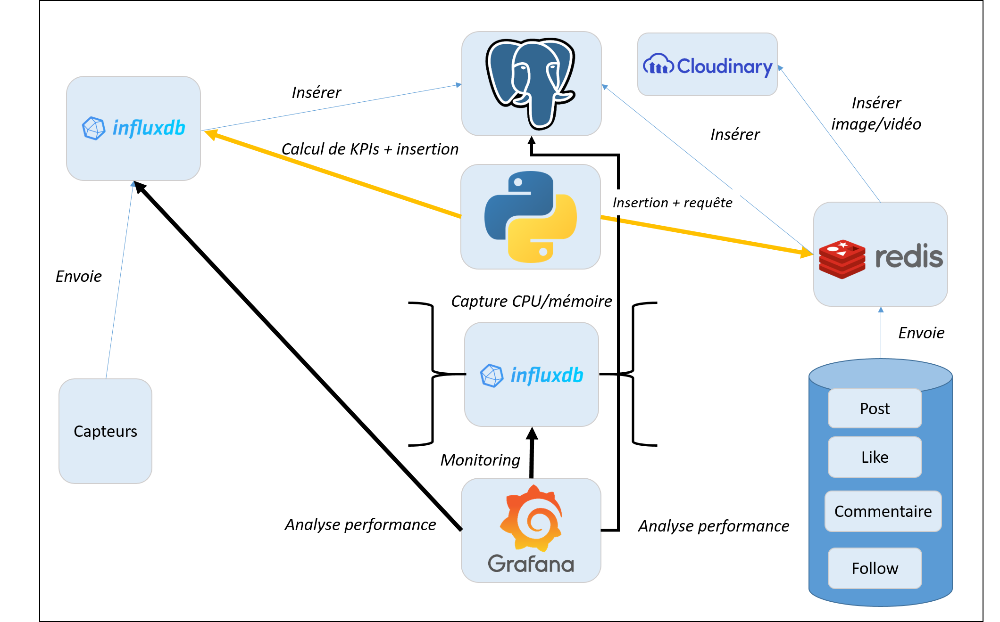
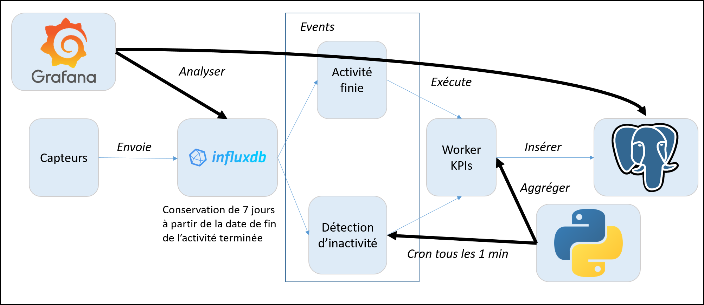
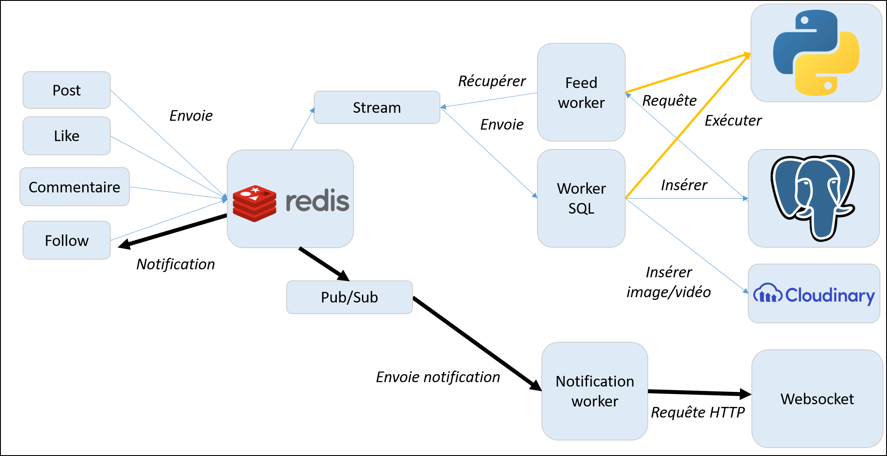
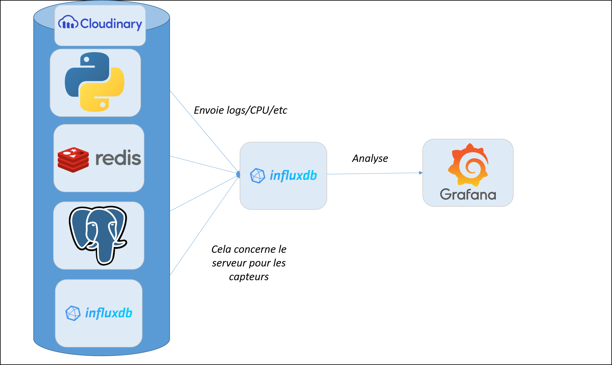
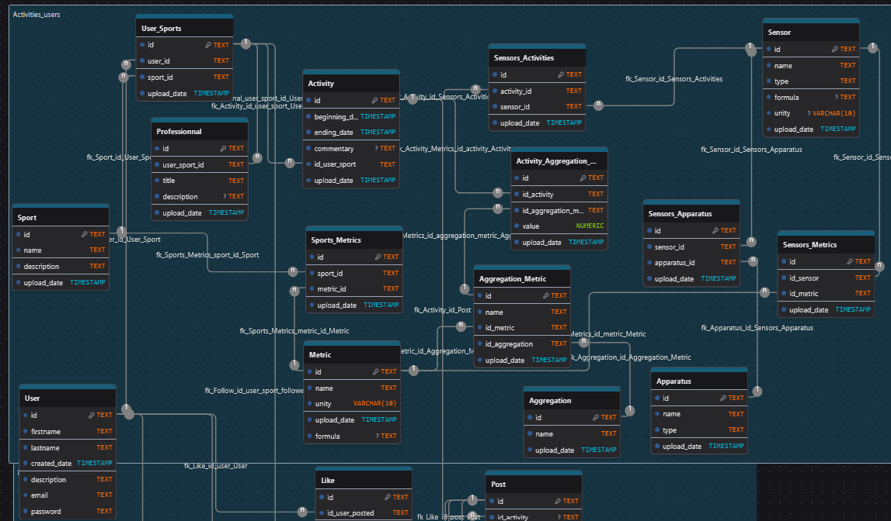
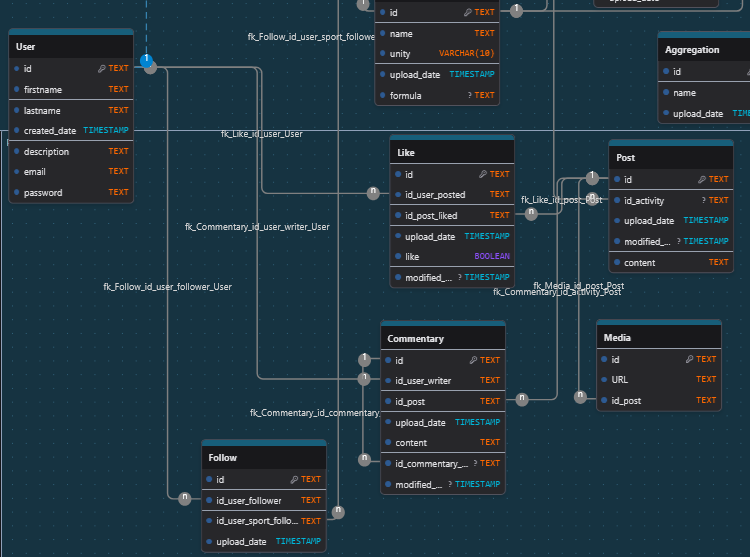
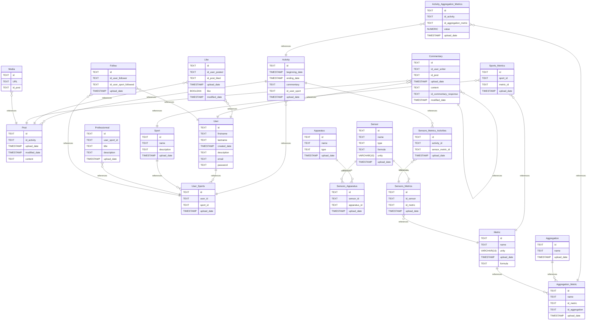

# Sujet : Plateforme de gestion d'un réseau social pour sportifs
## Auteur : Julien RENOULT
## Promo : PGE4 Spécialité Data
### *Date : 13/03/2026-23/03/2026*

# Introduction

Dans le cadre de notre projet, nous devions proposer une architecture permettant de faciliter la gestion des activités sportives dans un réseau social. Cette architecture devait répondre à plusieurs cas d'usages qui sont :

- la gestion des profils utilisateurs (compte, sports, professionnel)
- la gestion des relations sociales (like, follow, commentaire)
- la gestion des données d'entraînement en temps réels par des capteurs (gestion des mesures)
- la liaison entre ces différentes données (activité <=> post)
- le stockage des médias (images, vidéos)
- les statistiques et analyse de performance (indicateurs, tableau de bord)

En plus de répondre à ces cas d'usage, l'architecture devait répondre aussi à la problématique de volumétrie et de haute disponibilité des données. Pour pouvoir présenter facilement l'architecture, On va suivre la structure suivante. Cela commencera d'abord par une présentation des technologies utilisées, à quels cas d'usages cela répond, ensuite, les schémas conceptuels et physiques de ces bases de données, les procédures d'administrations sur chacune d'entre elle, le plan de sauvegarde avec celui de la reprise d'activité et pour finir évoquer l'évolution de cette architecture au fil du temps. Cette documentation se terminera par une petite conclusion résumant l'architecture proposée et des propositions d'améliorations sur celle-ci.

# Présentation des technologies utilisées et à quels cas d'usage cela répond
Dans cette première partie, je vais vous présenter toutes les technologies utilisées et leurs cas d'usage pour la plateforme.
On présentera rapidement la technologie concernée, ensuite on parlera des besoins qu'elle réponde.

## PostgreSQL

**PostgreSQL** est un **outil SGBD de type relationnel très adaptée dans la problématique du Big Data**. Il permet d'assurer les propriétés *ACID* de notre base et par conséquent la **cohérence** des données entre elle. Il est très robuste face à l'intensité des données, à la complexité des requêtes, et est le meilleur choix dans la construction de bases de données relationnelles et NoSQL.

Il est très utile aussi quand nous faisons face à une **grosse volumétrie des données** à stocker ce qui sera le cas avec la mise en place d'un réseau social. De plus, elle nous servira de liaison entre les données des activités réalisées et les posts du réseau social. Cet outil sera le plus adapté par rapport aux autres outils pour le **stockage historique des données**.

De plus, ça sera avec elle qu'on fera la gestion du compte, des capteurs, des appareils pour pouvoir lancer les activités et enregistrer des données de mesures.

Cet outil réponds donc aux cas d'usage de la **gestion de profils des utilisateurs**, de la **liaison entre les activités et le réseau social** et de **l'historique des données**.

    
     
    <i>Figure 1 : logo PostgreSQL</i>

## InfluxDB

**InfluxDB** est un **système de gestion de base de données orientée séries temporelles hautes performances**. C'est une base de type *Time Series*, c'est à dire qu'elle est conçue pour la collecte, le stockage et l'analyse de métriques en **temps réel**. Il est très utilisé pour la collecte de données par des capteurs ou pour des utilisations CPU/mémoire de serveurs.

Dans le cas de notre projet, il sera très utile pour collecter les métriques des différentes activités et les observer sur des périodes d'une journée. Il permettra en plus d'ajouter des politiques de rétention afin de vider facilement les données trop anciennes. Elle sera utile aussi avec Python pour le calcul des indicateurs finaux qui seront insérées ensuite dans la base de données relationnelles pour l'historique. 

On peut même ajouter l'aspect **monitoring** où cette base permettra de facilement surveiller les données de nos différents serveurs. Ces analyses seront fortement utiles pour de la **surveillance** mais aussi pour de **l'optimisation**.

Elle réponds donc au cas d'usage de la **gestion des données en temps réels de capteurs** mais aussi à la **surveillance/optimisation de nos serveurs**.

    
     
    <i>Figure 2 : logo InfluxDB</i>

## Redis

Redis est un système SGBD NoSQL qui est basée sur le *in-memory* (stockage en mémoire vive). Il se base sur les clés-valeurs et est très performant pour la gestion de cache et de broker Pub/Sub. 

C'est l'un des outils les plus populaires pour les **réseaux sociaux**, utilisées par de nombreuses entreprises comme X (anciennement Twitter) ou GitHub. Il est donc forcément très utile dans le cadre de notre projet pour la gestion des données côté réseaux sociaux.

Il va être très utilisée pour gérer en **différents worker** les données comme les posts, likes, commentaires, follows afin de proposer un service très rapide et qui soit résistant aux pannes. Il sera liée avec **Python** pour gérer ces données.

Il réponds donc aux cas d'usages de la **gestion des relations sociales** où la rapidité est primordiale pour cette application. De plus, sa gestion de la mémoire nous permettra d'éviter de saturer trop rapidement nos serveurs.

    
     
    <i>Figure 3 : logo Redis</i>

## Cloudinary

Cloudinary est une entreprise **SaaS** proposant une plateforme **cloud** simplifiant la gestion d'images et de vidéos dans les sites et applications mobiles. Il est très utile si vous voulez simplifier la compression, le téléversement et la récupération d'images et de vidéos.

Comme vous l'aurez sûrement deviné, cette technologie nous sera très utile pour la **gestion des médias côtés réseaux sociaux**. Il nous servira principalement de stockage de fichiers avec **la création d'URL** qui nous permettra d'aller les chercher facilement. Ces URL seront insérées dans la base de données relationnelles ce qui empêche d'avoir à gérer la conversion de nos images et vidéos.

Cet outil répond donc au cas d'usage de la **gestion des médias** grâce à son service de gestion des médias.

    
     
    <i>Figure 4 : logo Cloudinary</i>

## Grafana

Pour pouvoir analyser statistiquement toutes ces données, nous proposons d'utiliser **Grafana**. C'est un logiciel de Datavisualisation très utile car possédant des connecteurs de données de partout. Il pourra se connecter à nos bases de données (InfluxDB, PostgreSQL, Redis) et les liers très facilement sans trop de problèmes. De plus, il propose une analyse en temps réels ce qui n'est pas négligeable.

Grafana répondra donc au dernier cas d'usage qui est **l'analyse statistique des performances**.

    
     
    <i>Figure 5 : logo Grafana</i>

## Python

Passons rapidement pour **Python**. C'est un langage de programmation très populaire qui va nous être très utile pour la création de **workers**. 

Qu'est ce qu'on attend par worker ? C'est à dire qui vont gérer un cas spécifique comme l'insertion, la modification, le calcul d'indicateurs pour pouvoir l'insérer finalement dans notre base de données. 

Vous l'aurez donc peut-être compris, mais **Python** va nous servir à gérer la connexion entre les différentes bases de données avec les calculs nécessaires.

    
     
    <i>Figure 6 : logo Python</i>

# Architecture  et schémas des bases de données

Maintenant que nous avons fait la présentation de ces technologies, parlons maintenant des schémas de l'architecture. Ces schémas nous permettra d'expliquer d'une part les bases de données mais aussi comment elles vont communiquer entre elles. On commencera d'abord par l'architecture globale afin de vous montrer comment ça se passe. À la suite de ça, on ira plus en détails sur la partie *Activité* où on expliquera comment on va gérer les données des capteurs. Ensuite, on abordera le côté *réseaux sociaux* avec la gestion des posts, follows, commentaires et likes. Pour finir, on parlera du *monitoring* sur comment InfluxDB va intervenir sur les données de maintenance du système.

## Architecture globale

Comme vous pouvez observer ci-dessous, l'architecture de nos bases est composées de trois grandes parties qui sont l'activité, les réseaux sociaux et le monitoring. 

La première concernant l'activité va utiliser **InfluxDB** pour envoyer les données captée par les capteurs et les insérer dans la base de données relationnelles. **Grafana** et **Python** interviendront pour l'analyse des performances d'une part et l'insertion de KPIs dans la base de données d'autre part. 

La deuxième partie concernant les réseaux sociaux va utiliser deux technologies. La première est **Redis** pour la gestion des posts, commentaires, likes et follows. La deuxième **Cloudinary** va quant à lui gérer les images et vidéos de nos posts afin de les stocker facilement dans le cloud et ainsi insérer l'URL seulement dans la base de données. Cela simplifie énornément le stockage des médias. 

La dernière partie va quant à lui surveiller les serveurs utilisées par ces bases de données. C'est à dire qu'on va observer les performances de nos serveurs. Par exemple, si on observe des taux très élevés d'utilisation de CPU, on peut mener des actions d'urgence comme le bloquage de traffic afin de prévenir la panne de nos serveurs. C'est la partie du monitoring et les solutions utilisées sont **influxDB** et **Grafana**. 

Vous avez vu l'architecture globale, passons un peu plus en détails sur les différentes parties.

    
     
    <i>Figure 8 : architecture globale de nos bases de données</i>

## Activité

Commençons d'abord par le côté activité. Il faut rappeller que l'activité représente la capture de données par des capteur en temps réelles. Les solutions que nous avions proposé étaient InfluxDB, PostgreSQL pour stockage historique, Python pour la gestion des données entre elles et Grafana pour l'analyse de données en temps réelles. 

Le schéma de l'architecture pour les données des capteurs ressemblera à celle ci-dessous. Elle correspond à une architecture de type Event-Driven. Pour gérer l'envoie des métriques, nous avons faits plusieurs choix. 

Le premier était d'insérer les données dans le **SGBD relationnel** si et seulement si **l'activité sera terminée**. En effet, pour éviter la surcharge des requêtes d'insertions et de modifications, nous avons préféré créer deux types d'événements qui se déclencheront que si **l'activité est terminée** indiqué par l'utilisateur ou que **le capteur reste inactive pendant un certain temps**. 

Le deuxième choix était l'insertion uniquement de **métrique KPIs et pas des mesures brutes**. Pourquoi ? La volumétrie serait beaucoup trop à gérer et n'offrirait pas un **grand intérêt dans l'analyse des performances**. Les KPIs serait amplement suffisant selon nous pour obtenir une idée des performances sportives de l'utilisateur. De plus, malgré qu'on n'insère pas ces données dans la base de données relationnelle, nous pouvons quand même les analyser grâce à **Grafana** qui à la possibilité de se connecter à **InfluxDB**.

Le troisième choix était la **conservation des données de l'activité finie pendant 7 jours**. Pourquoi aussi peu de temps de conservation ? Pour libérer de la place très rapidement et limiter un **stockage trop volumineux**. De plus, les **KPIs seront déjà enregistrées** ce qui n'offrent pas d'intérêt de les garder dans une période longue.

Le dernier choix était sur l'analyse des performances sportives avec **Grafana**. On proposait un tableau de bord contenant les mesures de performances de la personne sur un filtrage du sport qui veut observer. Ce tableau de bord comparait les performances des différentes activités via les KPIs pré-calculés dans **PostgreSQL** et observer, pour **les activités réalisées moins de 7 jours**, les mesures sur une courbe d'une journée. Cela offrira un suivi clair et régulier des performances de l'utilisateur qui soit sportif ou non.

    
     
    <i>Figure 8 : architecture de la partie activité</i>

## Réseaux sociaux

Ensuite nous avons la partie concernant le réseau social à gérer. Pour répondre au besoin de rapidité et de permettre de follow facilement quelqu'un, nous proposons de séparer en deux sous-parties l'architectures. 

Tout d'abord, nous avons la partie nommé *Stream* possible avec l'outil *Redis Stream*. Qu'est ce qu'il permet de faire ? Il permet de gérer les données en quasi temps réels et de résister à la grande vague de données. Il nous est très utile pour l'insertion des données telles que les posts, likes, commentaires et les follows. De plus, il nous permet de préparer les résultats pour l'utilisateur via un feed worker. Ce worker au lieu d'insérer des données, va contenir sous Redis des résultats de requêtes comme les 500 posts les plus récentes du réseau social afin de répondre à la rapidité de retour de résultats pour l'utilisateur.

Plusieurs difficultés sont donc allégées via cette méthode. Cependant, nous faisons tout de même face à une difficulté plus grande qui est la gestion des follows. Malgré la pertinence du stream, elle nous permet pas de gérer facilement les notifications et demanderaient énornément de requêtes à faire côté base de données. Pour ce faire, une autre structure native dans *Redis* nommée *Pub/Sub* permet de régler ce problème. L'objectif est de faire les utilisateurs qui sont suivies en tant que **Publisher** et les utilisateurs qui suivent en tant que **Subscriber** via Redis. Grâce à cette fonctionnalités, cela nous permets facilement de notifier les personnes concernées via une requête HTTP vers un websocket. 

Pour la gestion des médias, nous utilisons **Cloudinary** afin de stocker celles-ci facilement et de pouvoir les retrouver facilement via une URL.

    
     
    <i>Figure 9 : architecture de la partie réseau social</i>

## Monitoring

Terminons la présentation de l'architecture en parlant rapidement du monitoring. Pour surveiller l'état de nos serveurs et bases de données, nous proposons d'utiliser une base influxdb séparée de celle des capteurs afin d'observer ces données spécifiquement. InfluxDB est très utilisée dans le surveillance des systèmes (CPU, mémoire, RAM, etc) ce qui fait un excellent choix aussi pour cette architecture. Pour pousser à fond dans l'analyse statistique, nous nous proposons d'utiliser Grafana afin d'avoir des visuels adaptées pour répondre à notre problématique de surveillance.

    
     
    <i>Figure 10 : architecture de la partie monitoring</i>

## Schéma de la base de données

Après avoir parlé de l'architecture et comment elle est construite, il est temps de présenter le schéma de la base de données relationnelle. Pour ce faire, nous le présenterons en deux parties avec la partie activité et la partie réseau social.

### Partie activité

La partie activité donc celle des capteurs est celle qui va contenir le plus de tables. Nous considérons que les appareils et capteurs doivent être enregistrées dans la base de données afin de sécuriser l'enregistrement d'une activité. 

Nous considérons que plusieurs capteurs peuvent être utilisées pour l'enregistrement d'une ou plusieurs activités. 

Pour avoir plus d'informations sur les **types de mesures, les aggrégations et quels mesures est associées avec tels sports**, nous avons créé plusieurs tables d'associations comme vous pouvez le voir ci-dessous (*Sports_Metrics, Sensors_Metrics, Aggregation_Metrics*). 

Sachez que toutes les informations concernant l'utilisateur (*User*), les capteurs (*Sensor*), les appareils d'enregistrement (*Apparatus*), les sports (*Sport*), si c'est professionnel ou non (*Profesionnal*), les types de mesures (*Metric*) et les aggrégations (*Aggregation*) doivent être enregistrées dans la base de données avant le lancement d'une activité. C'est pour assurer la cohérence de nos données et de savoir à qui on évalue (*User*), avec quoi on évalue (*Sensor*), de quels types de mesures sont ces capteurs (*Metric*), si l'utilisateur est un professionnel dans ce sport (*Professionnal*) et quels KPIs dois-je calculer pour cette activité (*Aggregation*) ? 

Pour le lancement d'une activité, nous utilisons la table **Aggregation** et **Aggregation_Metrics** afin de faire le calcul des KPIs qu'on a parlé précedemment et les insérer dans la base de données via les tables **Activity** et **Activity_Aggregation_Metrics**.

    
     
    <i>Figure 11 : schéma de la base de données côté activité</i>

#### User

| Name        | Type          | Settings                      | References                    | 
|-------------|---------------|-------------------------------|-------------------------------|
| **id** | TEXT | 🔑 PK, not null, unique | fk_User_id_User_Sport | |
| **firstname** | TEXT | not null |  | |
| **lastname** | TEXT | not null |  | |
| **created_date** | TIMESTAMP | not null |  | |
| **description** | TEXT | not null |  | |
| **email** | TEXT | not null |  | |
| **password** | TEXT | not null |  | | 

#### Sport

| Name        | Type          | Settings                      | References                    | 
|-------------|---------------|-------------------------------|-------------------------------|
| **id** | TEXT | 🔑 PK, not null, unique | fk_Sport_id_User_Sport |
| **name** | TEXT | not null |  |
| **description** | TEXT | not null |  |
| **upload_date** | TIMESTAMP | not null |  | 

#### Activity

| Name        | Type          | Settings                      | References                    |
|-------------|---------------|-------------------------------|-------------------------------|
| **id** | TEXT | 🔑 PK, not null, unique | fk_Activity_id_Post,fk_Activity_id_Sensors_Activities | |
| **beginning_date** | TIMESTAMP | not null |  | |
| **ending_date** | TIMESTAMP | not null |  | |
| **commentary** | TEXT | null |  | |
| **id_user_sport** | TEXT | not null | fk_Activity_id_user_sport_User_Sport | |
| **upload_date** | TIMESTAMP | not null |  | | 

Relations entre les tables :
- **Activity to User_Sports**: many_to_one

#### Activity_Aggregation_Metrics

| Name        | Type          | Settings                      | References                    | 
|-------------|---------------|-------------------------------|-------------------------------|
| **id** | TEXT | 🔑 PK, not null, unique |  |
| **id_activity** | TEXT | not null | fk_Activity_Metrics_id_activity_Activity |
| **id_aggregation_metric** | TEXT | not null | fk_Activity_Metrics_id_aggregation_metric_Aggregation_Metric |
| **value** | NUMERIC | not null |  |
| **upload_date** | TIMESTAMP | not null |  |

Relations entre les tables :
- **Activity_Aggregation_Metrics to Activity**: many_to_one
- **Activity_Aggregation_Metrics to Aggregation_Metric**: many_to_one

#### Metric

| Name        | Type          | Settings                      | References                    | 
|-------------|---------------|-------------------------------|-------------------------------|
| **id** | TEXT | 🔑 PK, not null, unique | fk_Metric_id_Aggregation_Metric | |
| **name** | TEXT | not null |  | |
| **unity** | VARCHAR(10) | not null |  | |
| **upload_date** | TIMESTAMP | not null |  | |
| **formula** | TEXT | null |  | | 

#### User_Sports

| Name        | Type          | Settings                      | References                    |
|-------------|---------------|-------------------------------|-------------------------------|
| **id** | TEXT | 🔑 PK, not null, unique |  | |
| **user_id** | TEXT | not null |  | |
| **sport_id** | TEXT | not null |  | |
| **upload_date** | TIMESTAMP | not null |  | | 

Relations entre les tables :
- **User to User_Sports**: one_to_many
- **Sport to User_Sports**: one_to_many

#### Professionnal

| Name        | Type          | Settings                      | References                    | 
|-------------|---------------|-------------------------------|-------------------------------|
| **id** | TEXT | 🔑 PK, not null, unique |  | |
| **user_sport_id** | TEXT | not null | fk_Professionnal_user_sport_id_User_Sport | |
| **title** | TEXT | not null |  | |
| **description** | TEXT | null |  | |
| **upload_date** | TIMESTAMP | not null |  | | 

Relations entre les tables :
- **Professionnal to User_Sports**: many_to_one

#### Sports_Metrics

| Name        | Type          | Settings                      | References                    | 
|-------------|---------------|-------------------------------|-------------------------------|
| **id** | TEXT | 🔑 PK, not null, unique |  | |
| **sport_id** | TEXT | not null | fk_Sports_Metrics_sport_id_Sport | |
| **metric_id** | TEXT | not null | fk_Sports_Metrics_metric_id_Metric | |
| **upload_date** | TIMESTAMP | not null |  | | 

Relations entre les tables :
- **Sports_Metrics to Metric**: many_to_one
- **Sports_Metrics to Sport**: many_to_one

#### Sensor

| Name        | Type          | Settings                      | References                    |
|-------------|---------------|-------------------------------|-------------------------------|
| **id** | TEXT | 🔑 PK, not null, unique | fk_Sensor_id_Sensors_Apparatus,fk_Sensor_id_Sensors_Activities,fk_Sensor_id_Sensors_Metrics | |
| **name** | TEXT | not null |  | |
| **type** | TEXT | not null |  | |
| **formula** | TEXT | null |  | |
| **unity** | VARCHAR(10) | null |  | |
| **upload_date** | TIMESTAMP | not null |  | | 

#### Apparatus

| Name        | Type          | Settings                      | References                    |
|-------------|---------------|-------------------------------|-------------------------------|
| **id** | TEXT | 🔑 PK, not null, unique | fk_Apparatus_id_Sensors_Apparatus | |
| **name** | TEXT | not null |  | |
| **type** | TEXT | not null |  | |
| **upload_date** | TIMESTAMP | not null |  | | 

#### Sensors_Apparatus

| Name        | Type          | Settings                      | References                    | Note                           |
|-------------|---------------|-------------------------------|-------------------------------|--------------------------------|
| **id** | TEXT | 🔑 PK, not null, unique |  | |
| **sensor_id** | TEXT | not null |  | |
| **apparatus_id** | TEXT | not null |  | |
| **upload_date** | TIMESTAMP | not null |  | | 

Relations entre les tables :
- **Apparatus to Sensors_Apparatus**: one_to_many
- **Sensor to Sensors_Apparatus**: one_to_many

#### Sensors_Activities

| Name        | Type          | Settings                      | References                    | Note                           |
|-------------|---------------|-------------------------------|-------------------------------|--------------------------------|
| **id** | TEXT | 🔑 PK, not null, unique |  | |
| **activity_id** | TEXT | not null |  | |
| **sensor_id** | TEXT | not null |  | |
| **upload_date** | TIMESTAMP | not null |  | | 

Relations entre les tables :
- **Activity to Sensors_Activities**: one_to_many
- **Sensor to Sensors_Activities**: one_to_many

#### Aggregation

| Name        | Type          | Settings                      | References                    | Note                           |
|-------------|---------------|-------------------------------|-------------------------------|--------------------------------|
| **id** | TEXT | 🔑 PK, not null, unique | fk_Aggregation_id_Aggregation_Metric | |
| **name** | TEXT | not null |  | |
| **upload_date** | TIMESTAMP | not null |  | | 

#### Aggregation_Metric

| Name        | Type          | Settings                      | References                    |
|-------------|---------------|-------------------------------|-------------------------------|
| **id** | TEXT | 🔑 PK, not null, unique |  | |
| **name** | TEXT | not null |  | |
| **id_metric** | TEXT | not null |  | |
| **id_aggregation** | TEXT | not null |  | |
| **upload_date** | TIMESTAMP | not null |  | | 

Relations entre les tables :
- **Aggregation to Aggregation_Metric**: one_to_many
- **Metric to Aggregation_Metric**: one_to_many

#### Sensors_Metrics

| Name        | Type          | Settings                      | References                    |
|-------------|---------------|-------------------------------|-------------------------------|
| **id** | TEXT | 🔑 PK, not null, unique |  | |
| **id_sensor** | TEXT | not null |  | |
| **id_metric** | TEXT | not null | fk_Sensors_Metrics_id_metric_Metric | |
| **upload_date** | TIMESTAMP | not null |  | | 

Relations entre les tables :
- **Sensor to Sensors_Metrics**: one_to_many
- **Sensors_Metrics to Metric**: many_to_one

### Partie réseau social

Pour ce qui est du réseau social, c'est largement plus simple car nous devions juste gérer les posts, likes, commentaires, les médias et les follows. ça se fera avec cinq tables différentes réliées essentiellement avec l'utilisateur (*User*), l'activité (*Activity*) et le sport suivi (*Sports_Users*) de l'autre partie.

Nous avons fait un choix au niveau de nos posts qui peuvent ou non être lié à une activité. Dans la description du projet, il nous est demandé qu'une activité ne correspond qu'à un seul post. Les posts peuvent être donc être sur le sujet de la réalisation d'une activité mais aussi d'un tout autre sujet liée au sport (Exemple : victoire d'une compétition).

    
     
    <i>Figure 12 : schéma de la base de données côté réseau social</i>

#### Post

| Name        | Type          | Settings                      | References                    |
|-------------|---------------|-------------------------------|-------------------------------|
| **id** | TEXT | 🔑 PK, not null, unique |  | |
| **id_activity** | TEXT | null |  | |
| **upload_date** | TIMESTAMP | not null |  | |
| **modified_date** | TIMESTAMP | null |  | |
| **content** | TEXT | not null |  | | 

Relations entre les tables :
- **Activity to Post**: one_to_many

#### Like

| Name        | Type          | Settings                      | References                    |
|-------------|---------------|-------------------------------|-------------------------------|
| **id** | TEXT | 🔑 PK, not null, unique |  | |
| **id_user_posted** | TEXT | not null | fk_Like_id_user_User | |
| **id_post_liked** | TEXT | not null | fk_Like_id_post_Post | |
| **upload_date** | TIMESTAMP | not null |  | |
| **like** | BOOLEAN | not null |  | |
| **modified_date** | TIMESTAMP | null |  | | 

Relations entre les tables :
- **Like to User**: many_to_one
- **Like to Post**: many_to_one

#### Commentary

| Name        | Type          | Settings                      | References                    |
|-------------|---------------|-------------------------------|-------------------------------|
| **id** | TEXT | 🔑 PK, not null, unique |  | |
| **id_user_writer** | TEXT | not null | fk_Commentary_id_user_writer_User | |
| **id_post** | TEXT | not null | fk_Commentary_id_activity_Post | |
| **upload_date** | TIMESTAMP | not null |  | |
| **content** | TEXT | not null |  | |
| **id_commentary_response** | TEXT | null | fk_Commentary_id_commentary_response_Commentary | |
| **modified_date** | TIMESTAMP | null |  | | 

Relations entre les tables :
- **Commentary to User**: many_to_one
- **Commentary to Post**: many_to_one
- **Commentary to Commentary**: many_to_one

### Follow

| Name        | Type          | Settings                      | References                    |
|-------------|---------------|-------------------------------|-------------------------------|
| **id** | TEXT | 🔑 PK, not null, unique |  | |
| **id_user_follower** | TEXT | not null | fk_Follow_id_user_follower_User | |
| **id_user_sport_followed** | TEXT | not null | fk_Follow_id_user_sport_followed_User_Sport | |
| **upload_date** | TIMESTAMP | not null |  | | 

Relations entre les tables :
- **Follow to User**: many_to_one
- **Follow to User_Sports**: many_to_one

### Media

| Name        | Type          | Settings                      | References                    |
|-------------|---------------|-------------------------------|-------------------------------|
| **id** | TEXT | 🔑 PK, not null, unique |  | |
| **URL** | TEXT | not null |  | |
| **id_post** | TEXT | not null | fk_Media_id_post_Post | |

Relations entre les tables :
- **Media to Post**: many_to_one

## Diagramme de la base de données

# Procédures d'administrations 

Les procédures d'administrations sont une part importante pour la sécurité et la confidentialité des données. 
Nous parlerons d'abord des **rôles** pour PostgreSQL, ensuite des **tokens** d'InfluxDB et pour finir les **users** Redis.

## PostgreSQL

Pour ce qui est des rôles sous PostgreSQL, nous avons créé cinq rôles principales pour une bonne gestion de la base de données :
- **SENSOR** : rôle spécifique pour les capteurs afin de lire les données nécessaires à l'écriture de l'activité
- **SOCIAL_MEDIA_USER** : rôle spécifique pour le côté réseau social afin de lire les données concernant uniquement de l'activité, l'utilisateur 
et pour l'écriture des posts, médias, professionnel, commentaires et likes
- **DATA_ANALYST** : rôle pour seulement la lecture des données concernant les activités pour l'analyse de performance
- **MAINTENEUR** : rôle pour surveiller et appliquer des actions urgentes si nécessaires dans les données

Vous trouverez le tableau ci-dessous pour la description des rôles et ce qui est possible de faire avec eux.

**Légende : R - Lecture, W - Ecriture, M - Modifier, D - Effacer**

| Table                          | SENSOR | SOCIAL_MEDIA_USER | DATA_ANALYST | ANALYSE_PERFORMANCE | MAINTENEUR |
|--------------------------------|--------|-------------------|--------------|----------------------|-----------|
| Activity                       | W      | R                 | R            | R                    | R/W/M/D |
| Activity_Aggregations_Metrics  | W      | -                 | R            | R                    | R/W/M/D |
| Sensors_Metrics_Activities     | W      | -                 | R            | R                    | R/W/M/D |
| Aggregation                    | R      | -                 | R            | R                    | R/W/M/D |
| Aggregation_Metric             | R      | -                 | R            | R                    | R/W/M/D |
| Apparatus                      | R      | -                 | R            | R                    | R/W/M/D |
| Sensor                         | R      | -                 | R            | R                    | R/W/M/D |
| Sensors_Apparatus              | R      | -                 | R            | R                    | R/W/M/D |
| Sensors_Metrics                | R      | -                 | R            | R                    | R/W/M/D |
| Sport                          | R      | R                 | R            | R                    | R/W/M/D |
| Sports_Metrics                 | R      | -                 | R            | R                    | R/W/M/D |
| User                           | R      | R                 | R            | R                    | R/W/M/D |
| User_Sports                    | R      | R/W/M/D           | R            | R                    | R/W/M/D |
| Follow         | -      | R/W/M/D           | R            | -                    | R/W/M/D |
| Media          | -      | R/W/M/D           | R            | -                    | R/W/M/D |
| Post           | -      | R/W/M/D           | R            | -                    | R/W/M/D |
| Professionnal  | -      | R/W/M/D           | R            | -                    | R/W/M/D |
| Commentary     | -      | R/W/M/D           | R            | -                    | R/W/M/D |
| Like           | -      | R/W/M/D           | R            | -                    | R/W/M/D |

## InfluxDB

Pour ce qui est d'InfluxDB, la gestion des autorisations se faits à travers les tokens. Pour ce faire, deux tokens sont créées.
Une pour la lecture des données sur le bucket (read-only) et de l'autre pour l'écriture des données sur le bucket (write-only).
De cette façon, nous respectons le principe de moindre privilèges en séparant l'écriture et la lecture en deux tokens.
Un dernier token est créé pour les admins afin de gérer la base de données.

## Redis

Pour ce qui est de Redis, la gestion des droits vont se faire via quatre utilisateurs dont l'administrateur, 
l'utilisateur du réseau social, le capteur pour le cache et le worker pour les différents workers.
Vous trouverez un tableau ci-dessous expliquant plus en détails les autorisations qu'ont ces utilisateurs.

**Légende : ALL - Toutes les commandes, GET/MGET - Lecture, EXISTS - Vérifier existence, DEL - Effacer, INCR - Incrémenter valeur numérique, PUBLISH/SUBSCRIBE - Abonnement Désabonnement**

| Table                          | ADMIN  | SOCIAL_MEDIA_USER | ACTIVITY_SENSOR_CACHE | WORKER |
|--------------------------------|--------|-------------------|--------------|----------------------|
| Post                           | ALL    | GET/MGET/EXISTS/SET/DEL/INCR/PUBLISH/SUBSCRIBE | -                           | ALL                    |
| Commentary                     | ALL    | GET/MGET/EXISTS/SET/DEL/INCR/PUBLISH/SUBSCRIBE | -                           | ALL                    |
| Like                           | ALL    | GET/MGET/EXISTS/SET/DEL/INCR/PUBLISH/SUBSCRIBE | -                           | ALL                    |
| Follow                         | ALL    | GET/MGET/EXISTS/SET/DEL/INCR/PUBLISH/SUBSCRIBE | -                           | ALL                    |
| Activity                       | ALL    | -                                              |  GET/MGET/SET/DEL           | ALL            |
| Media                          | ALL    | GET/MGET/EXISTS/SET/DEL/INCR/PUBLISH/SUBSCRIBE | -                           | ALL                    |

# Plan de sauvegarde et de reprise d'activité

Dans le cas d'un scénario engageant une panne au sein du système, 
nous devons prioriser la restauration de la base de données **PostgreSQL**. 
C'est cette base qui est source de vérité tant pour les activité et les posts du réseau social.

Ensuite, on passera sur **Redis** en deuxième pour la mise en disponibilité de l'application le plus rapidement possible.

Pour finir, **l'influxDB et Grafana** seront remises en service dès que les autres bases de données seront mises en service.
Ce que vous trouverez ci-dessous est le détail des backup créés pour chaque base et la politique de rétention associée.

## PostgreSQL

La base de données **PostgreSQL** a un backup généré tous les 2 jours via pg_dump.
Elle est gardée pendant 7 jours et sera supprimée ensuite pour limiter le volume de stockage. 

## Redis

La base de données **Redis** a un backup généré tous les 24 heures.
Le backup est gardé pendant 2 jours et sera supprimée ensuite pour ne garder que les données très récentes.
On est sur des données très volatiles ce qui n'offre pas d'intérêt de le garder longtemps.

## InfluxDB

La base de données **InfluxDB** a un backup généré tous les 24 heures.
Le backup est gardé pendant 3 jours afin de garder les activités réalisées récentes si les bases de données sont en pannes.
On est sur des données aussi très volatiles donc on ne doit pas les garder pour longtemps.

## Grafana

Pour **Grafana**, un backup sera généré tous les 24 heures afin de surveiller les modifications Grafana.
Le backup est gardé pendant 7 jours afin d'avoir les modifications sur chaque versions et de les utiliser si un bug apparaît.

# La stratégie de mise à l'échelle de votre solution

Pour mettre en place cette solution qui n'est encore que dans le stade de développement, 
nous proposons plusieurs étapes afin de bien gérer cette solution :
- **création des workers pour l'intéraction avec les bases de données**
- **création des scripts pour l'utilisation du backup créé**
- **création des dashboards pour la performance et le monitoring**
- **mise en production de cette architecture**

L'objectif de cette première version
afin de montrer le potentiel de cette architecture et de son efficacité.

Bien sûr de nombreux tests devront être menés afin d'assurer l'efficacité 
et la résistance des bases de données fâce aux gros flux de données.
